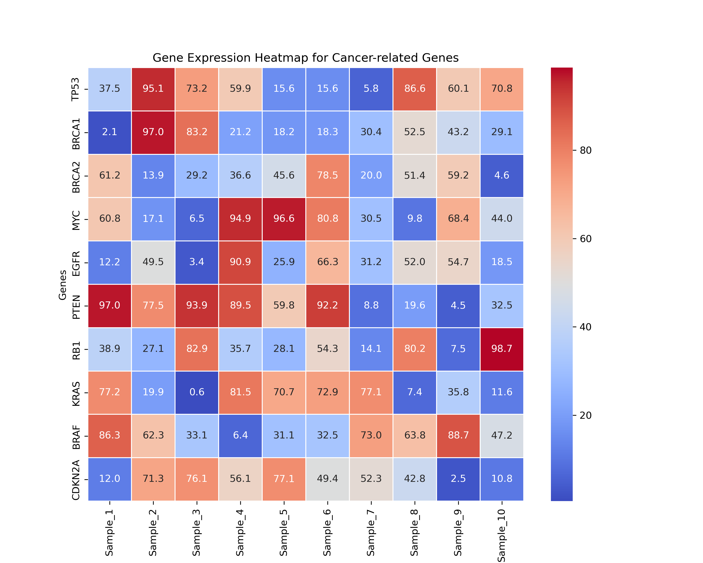

# Computational Genomics Pipeline for Gene Expression Analysis

## Overview
This project is a **computational genomics pipeline** designed to analyze **gene expression** in **cancer and brain development**. It automates key RNA-Seq data analysis steps, including:
- **Alignment of sequencing reads** (using STAR)
- **Read quantification** (using featureCounts)
- **Differential expression analysis** (using DESeq2 in R)
- **Functional enrichment analysis** (using gseapy for Gene Ontology analysis)
- **Visualization of gene expression** (using Matplotlib & Seaborn)

## Features
- **Fully automated pipeline** for RNA-Seq analysis
- **Scalability** for large datasets
- **Modular implementation**, making it easy to modify or extend
- **Integration with R** for robust statistical analysis
- **High-quality visualization outputs**

## Installation
### Prerequisites
Ensure you have the following dependencies installed:
- Python (>=3.8)
- R (>=4.0)
- Required Python packages:
  ```bash
  pip install pandas seaborn matplotlib bioinfokit gseapy
  ```
- Required R packages:
  ```r
  install.packages("DESeq2")
  ```

## Usage
### Running the Pipeline
The pipeline is structured as follows:
```bash
python main.py
```

### Example Workflow
1. Prepare raw FASTQ files and metadata.
2. Set up genome index for STAR alignment.
3. Run the alignment script.
4. Perform read quantification.
5. Run differential expression analysis.
6. Conduct Gene Ontology enrichment analysis.
7. Generate visualization of key genes.

### Expected Output
- **Aligned BAM files** (stored in `aligned_data/`)
- **Gene expression counts** (stored in `counts/`)
- **Differential expression results** (`differential_expression/deseq2_results.csv`)
- **GO enrichment results** (`go_enrichment_results.csv`)
- **Heatmap visualization of selected genes** (`figures/gene_expression_heatmap.png`)

## Example Visualization
The following is an example heatmap of key gene expressions:



## Contributing
If you would like to contribute to this project, feel free to submit a **pull request** or open an **issue**.

## License
This project is licensed under the MIT License.

## Contact
For inquiries or collaborations, contact:
**Etienne Ntumba Kabongo**
Email: [etienne.ntumba.kabongo@umontreal.ca](mailto:etienne.ntumba.kabongo@umontreal.ca)

